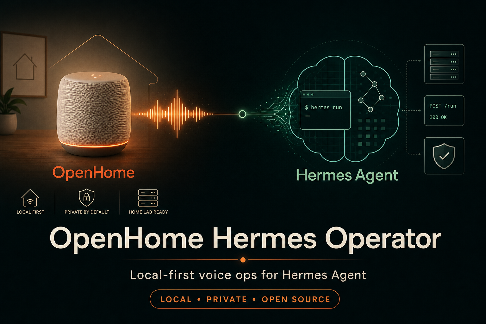

# OpenHome Hermes Operator



[](https://github.com/joeynyc/openhome-hermes-operator/actions/workflows/ci.yml)
[](https://www.python.org/)
[](LICENSE)

Local-first voice operations for Hermes Agent through OpenHome.

OpenHome is the mic and speaker. Hermes is the agent brain. Together they become a voice operator for home-lab work: check model servers, read logs, run benchmarks, manage services, trigger skills, and speak back short status summaries.

```text
"Jetson, check my local model server and tell me if anything crashed."
```

## Status

Pre-device build is ready. The bridge, tests, fake mode, CLI simulator, and OpenHome ability package are complete. Remaining work requires the physical OpenHome device/dashboard.

## Architecture

```text
OpenHome Ability -> FastAPI bridge -> Hermes API Server -> tools/models/actions -> spoken summary
```

## Quick start

```bash
git clone https://github.com/joeynyc/openhome-hermes-operator.git
cd openhome-hermes-operator
python3 -m venv .venv
source .venv/bin/activate
pip install -e '.[dev]'
python -m pytest tests -v
```

## Run fake mode

Fake mode works without an OpenHome device and without a live Hermes server.

```bash
# terminal 1
source .venv/bin/activate
export HERMES_OPERATOR_TOKEN=dev-token
./scripts/run_bridge_fake.sh
```

```bash
# terminal 2
export HERMES_OPERATOR_TOKEN=dev-token
./scripts/demo_curl.sh "check my local model server"
python -m hermes_operator.cli "check my local model server"
```

Expected:

```text
Hermes fake mode is working. I received: check my local model server
```

## Run with live Hermes

Start Hermes API Server separately, then run:

```bash
source .venv/bin/activate
export HERMES_API_BASE_URL=http://127.0.0.1:8642/v1
export HERMES_API_KEY=dev-token
export HERMES_API_MODEL=hermes-agent
export HERMES_OPERATOR_TOKEN=dev-token
./scripts/run_bridge_live.sh
```

Call the bridge:

```bash
python -m hermes_operator.cli "Say hello in one short sentence."
```

## Package for OpenHome

```bash
./scripts/package_ability.sh
```

Output:

```text
/tmp/hermes-operator-openhome-ability.zip
```

Upload the zip in the OpenHome dashboard when the device/account is ready.

Suggested device config:

```bash
OPENHOME_HERMES_BRIDGE_URL=http://192.168.1.201:8787/run
OPENHOME_HERMES_BRIDGE_TOKEN=dev-token
OPENHOME_HERMES_TIMEOUT=240
```

## API

```text
POST /run
Authorization: Bearer <token>   # only required if HERMES_OPERATOR_TOKEN is set
```

```json
{"task":"check my local model server","session_id":"optional"}
```

```json
{"ok":true,"spoken_summary":"short voice-safe answer","raw_text":"full Hermes response","artifact_path":null}
```

## Ship checklist

```bash
source .venv/bin/activate
pip install -e '.[dev]'
python -m pytest tests -v
python -m build
./scripts/package_ability.sh
```

## Docs

- Architecture: `docs/architecture.md`
- Pre-device runbook: `docs/pre-device-wiring.md`
- OpenHome application pitch: `docs/openhome-application.md`
- Ability README: `openhome_ability/hermes-operator/README.md`

## License

MIT. See `LICENSE`.
